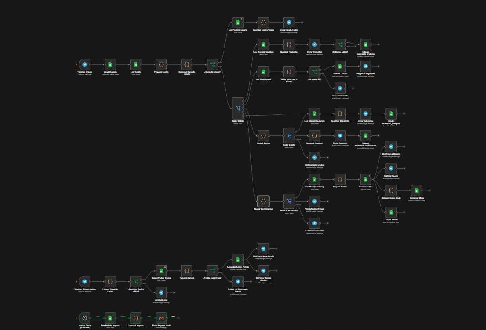
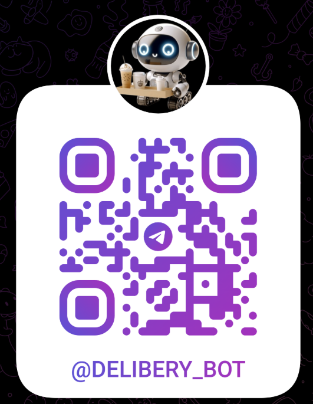
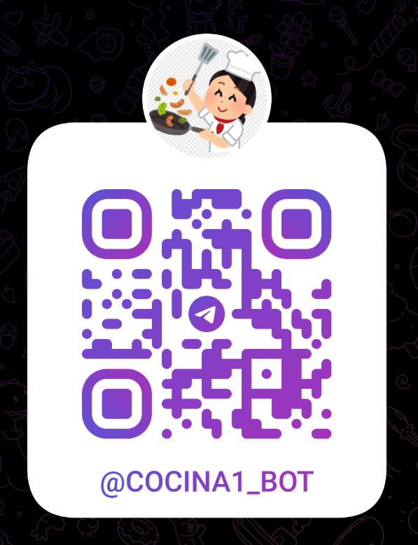
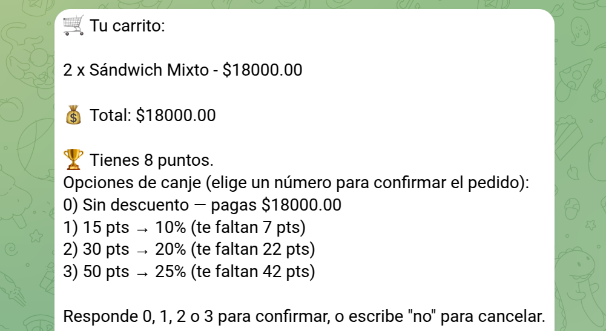

# ☕ DeliveryBot

DeliveryBot es una solución de automatización desarrollada en **n8n** que permite gestionar pedidos de cafetería mediante un chatbot de **Telegram**. El sistema busca reducir las filas, minimizar errores en la toma de pedidos y mejorar la comunicación entre los clientes y el personal de cocina.



- Google Sheets: https://docs.google.com/spreadsheets/d/14AMz5i5fAOS7Ja4Q7S6VHrxyUcMJo7B7z5Tc4NEKKWM/edit?usp=sharing

---

# 📖 Problemática

En instituciones como universidades, oficinas o centros de trabajo, la gestión de pedidos en cafeterías suele realizarse de forma manual, generando:

- Largas filas durante las horas de mayor demanda.
- Errores al registrar pedidos.
- Dificultad para controlar el inventario.
- Falta de comunicación entre la cocina y el cliente.
- Ausencia de reportes automáticos de ventas.

DeliveryBot digitaliza este proceso utilizando Telegram como interfaz conversacional y n8n como motor de automatización.

---

# 🎯 Objetivos

- Automatizar el proceso de pedidos mediante Telegram.
- Permitir la navegación por categorías del menú.
- Gestionar un carrito de compras.
- Validar disponibilidad de productos.
- Generar pedidos con identificadores únicos.
- Actualizar automáticamente el inventario.
- Notificar a cocina cuando exista un nuevo pedido.
- Informar al cliente sobre el estado de su orden.
- Generar reportes automáticos de ventas.

---

# 🛠 Tecnologías utilizadas

- n8n
- Telegram Bot API
- Google Sheets
- JavaScript
- Docker
- Ngrok

---

# 🗄 Base de Datos

El sistema utiliza Google Sheets como base de datos.

## MENU

| Campo | Descripción |
|---------|------------|
| id_producto | Identificador del producto |
| nombre | Nombre del producto |
| descripcion | Descripción |
| precio | Precio |
| categoria | Bebidas, Comidas o Snacks |
| stock | Cantidad disponible |

---

## PEDIDOS

| Campo | Descripción |
|---------|------------|
| id_pedido | Identificador del pedido |
| id_usuario | Usuario que realizó el pedido |
| detalles_pedido | Productos solicitados |
| total_pago | Valor total |
| estado | Estado actual |
| fecha | Fecha |
| hora | Hora |

---

## USUARIOS

| Campo | Descripción |
|---------|------------|
| telegram_id | ID del usuario |
| nombre_completo | Nombre |

---

## SESSIONS

Permite mantener el estado de la conversación.

| Campo | Descripción |
|---------|------------|
| telegram_id | Usuario |
| pantalla_actual | Estado del flujo |
| carrito_temporal | Productos seleccionados |
| ultimo_cambio | Última actualización |

---

# ⚙ Arquitectura del proyecto

El proyecto está dividido en tres workflows independientes.

## 1. Workflow Cliente

Se encarga de toda la interacción con el usuario.

### Funciones

- Registro automático del usuario.
- Consulta del menú.
- Navegación por categorías.
- Selección de productos.
- Gestión del carrito.
- Confirmación del pedido.
- Actualización de sesiones.
- Registro del pedido.
- Notificaciones al cliente.

---

## 2. Workflow Cocina

Responsable de administrar los pedidos recibidos.

### Funciones

- Consultar pedidos pendientes.
- Cambiar el estado del pedido.
- Notificar al cliente cuando el pedido cambia de estado.
- Marcar pedidos como entregados.

Estados utilizados:

- Recibido
- Preparación
- Entregado

---

## 3. Workflow Reportes

Workflow programado mediante un Trigger Scheduler.

Genera automáticamente:

- Total de ventas.
- Cantidad de pedidos.
- Productos más vendidos.
- Reporte diario enviado por correo.

---

# 🔄 Flujo del Cliente

```text
Inicio

↓

Registro automático

↓

Menú principal

↓

Seleccionar categoría

↓

Mostrar productos

↓

Elegir producto

↓

Elegir cantidad

↓

Agregar al carrito

↓

¿Agregar otro producto?

↓

No

↓

Confirmar pedido

↓

Validar stock

↓

Registrar pedido

↓

Actualizar inventario

↓

Notificar cocina

↓

Notificar cliente
```

---

# 🍔 Flujo de Cocina

```text
Nuevo pedido

↓

Consultar pedidos pendientes

↓

Seleccionar pedido

↓

Cambiar estado

↓

Actualizar Google Sheets

↓

Notificar al cliente
```

---

# 📊 Flujo de Reportes

```text
Scheduler

↓

Leer pedidos

↓

Calcular ventas

↓

Generar reporte

↓

Enviar correo
```

---

# 📌 Funcionalidades implementadas

✅ Registro automático de usuarios

✅ Consulta del menú

✅ Navegación por categorías

✅ Selección de productos

✅ Gestión del carrito

✅ Confirmación del pedido

✅ Registro automático en Google Sheets

✅ Actualización del inventario

✅ Gestión de estados del pedido

✅ Notificaciones por Telegram

✅ Reportes automáticos


---

# 🚀 Posibles mejoras

- Pago mediante Nequi o QR.
- Panel web para administración.
- Sistema de puntos y recompensas.
- Historial completo de pedidos.
- Estadísticas en tiempo real.
- Botones interactivos de Telegram.
- Integración con bases de datos SQL.

---

# 👨‍💻 Autores

Proyecto desarrollado por **MARIO ROJAS** como solución académica utilizando **n8n**, **Telegram** y **Google Sheets** para automatizar el proceso de pedidos de cafetería.

# Delivery Bot


# Cocina Bot



# UPDATE: Examen 1 

# Sistema de Acumulación de Puntos para Bot de Cafetería

## Descripción

Se implementó un sistema de fidelización para el bot de la cafetería con el objetivo de incentivar las compras mediante la acumulación de puntos.

Por cada pedido confirmado, el usuario recibe puntos de acuerdo con el valor total de su compra. Estos puntos son almacenados en el perfil del usuario y pueden consultarse desde el menú principal del bot.

---

# Objetivos

- Calcular automáticamente los puntos obtenidos en cada compra.
- Actualizar el perfil del usuario con el nuevo saldo de puntos.
- Permitir al usuario consultar sus puntos acumulados desde el menú principal.

---

# Requerimientos Implementados

## 1. Lógica de Cálculo

Durante el flujo de **Confirmación del Pedido** se realiza el cálculo de puntos mediante una expresión matemática.

### Regla de negocio

- **1 punto por cada $4.000 COP gastados.**

### Expresión utilizada
 
```javascript
Math.floor(totalCompra / 4000)
```


Donde:

- `totalCompra` corresponde al valor total del pedido.
- `Math.floor()` garantiza que únicamente se otorguen puntos completos.

### Ejemplos

| Total de compra | Puntos obtenidos |
|----------------:|----------------:|
| $3.500 | 0 |ªº
| $8.000 | 2 |
| $12.500 | 3 |
| $25.000 | 6 |
| $40.000 | 10 |

---

## 2. Persistencia de Datos

Una vez calculados los puntos:

1. Se busca al usuario en la hoja **USUARIOS** utilizando el campo:

```text
telegram_id
```

2. Se obtiene el saldo actual de puntos.

3. Se realiza la suma:

```text
Puntos Nuevos = Puntos Actuales + Puntos Ganados
```

4. Finalmente se actualiza el registro del usuario en la hoja de cálculo.

### Ejemplo

Antes:

| telegram_id | Nombre | Puntos |
|-------------|---------|--------|
| 123456789 | Juan | 18 |

Compra realizada:

```text
$16.000
```

Puntos ganados:

```text
4
```

Después de actualizar:

| telegram_id | Nombre | Puntos |
|-------------|---------|--------|
| 123456789 | Juan | 22 |

---

## 3. Menú Principal

Se agregó una nueva opción al menú principal:

```text
1. Hacer Pedido

2. Ver Menú

3. Mis Pedidos

4. Ver mis Puntos
```

Al seleccionar la opción **4**, el bot consulta el registro del usuario y obtiene el valor almacenado en la columna de puntos.

---

## 4. Respuesta del Bot

Cuando el usuario consulta su saldo de puntos, el bot responde con el siguiente mensaje:

```text
Hola [Nombre], actualmente tienes 🏆 [Puntos] puntos acumulados.

¡Sigue comprando para canjear premios!
```


### Ejemplo

```text
Hola Juan,

Actualmente tienes 🏆 22 puntos acumulados.

¡Sigue comprando para canjear premios!
```

---

# Tecnologías Utilizadas

- Telegram Bot
- n8n
- Google Sheets
- Nodo **Set** o **Edit Fields** para el cálculo matemático
- Expresiones en JavaScript

---

# Resultado

Con esta implementación se cumple el sistema de fidelización solicitado:

- ✅ Cálculo automático de puntos por compra.
- ✅ Uso de una expresión matemática para el cálculo.
- ✅ Actualización del saldo de puntos del usuario.
- ✅ Persistencia de la información en la hoja **USUARIOS**.
- ✅ Nueva opción **"Ver mis Puntos"** en el menú principal.
- ✅ Respuesta personalizada mostrando el total de puntos acumulados.